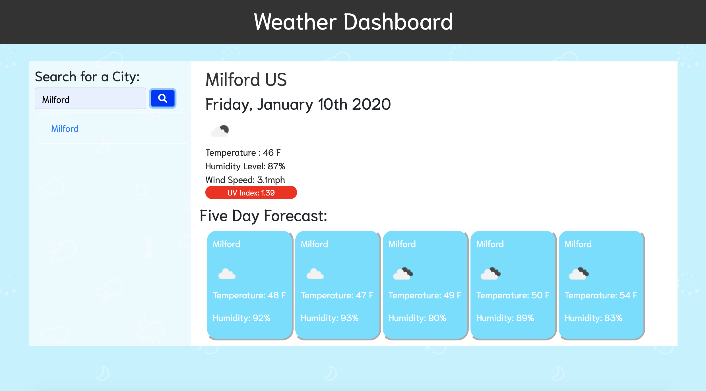

# Weather-Dashboard
https://shelbypalumbo.github.io/Weather-Dashboard/

## User Story
As a commuter, I want to be able to check the daily weather forecast, so that I am prepare for poor traffic conditions and layer up accordingly!

## Usage
This application allows a user to input a city name and view the present, and following five day, weather conditions.

Below the search side bar, links to previously searched cities are logged and available to click for future forecast navigation.

## Programming Languages Used
* JavaScript
* HTML
* CSS

### Additional Styling Framework 
* Bootstrap | https://getbootstrap.com/
* Fontsawesome icons | https://fontawesome.com/icons?d=gallery&m=free
