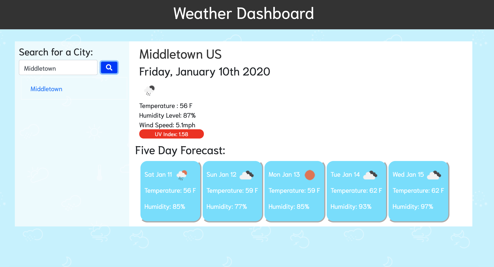

# Weather-Dashboard
A weather dashboard application using the OpenWeather API.

https://shelbypalumbo.github.io/Weather-Dashboard/

## User Story
As a commuter, I want to be able to check the daily weather forecast, so that I am well prepared for poor weather conditions and can layer up accordingly!

## Usage
This application allows a user to search a city by name and view the present, followed by the five day, weather forecast.

Below the search side bar, links to previously searched cities are logged and available to click for future forecast navigation.

## Programming Languages Used
* JavaScript
* HTML
* CSS

## API 
OpenWeather https://openweathermap.org/api

### Additional Styling Framework 
* Bootstrap | https://getbootstrap.com/
* Fontsawesome icons | https://fontawesome.com/icons?d=gallery&m=free
